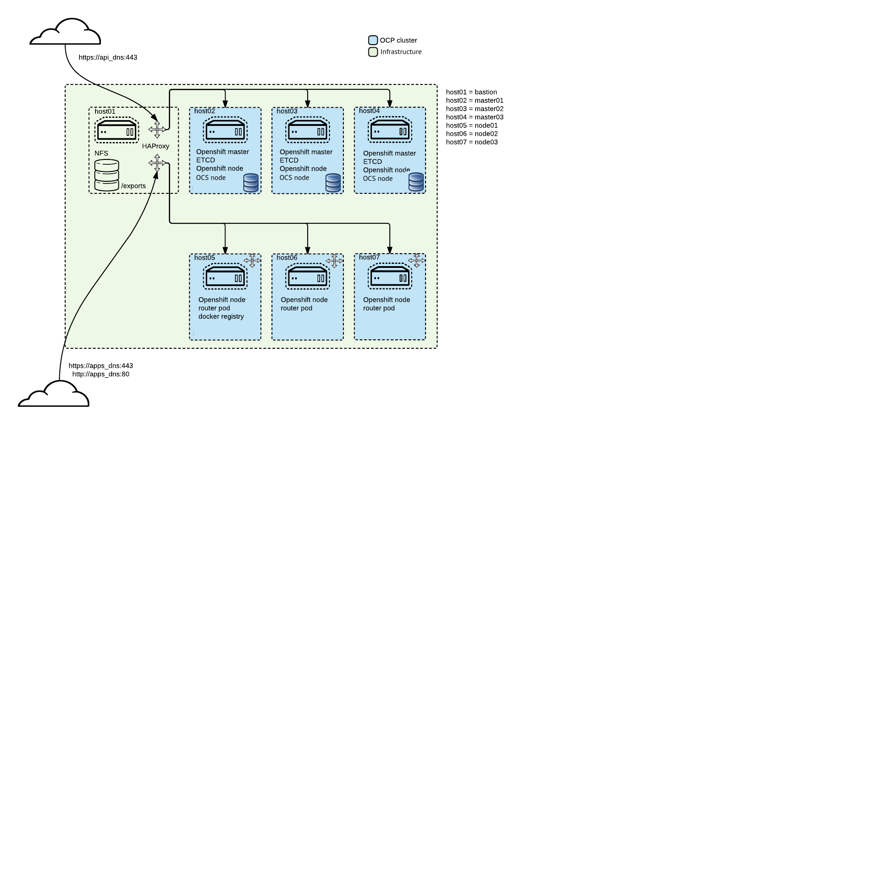

= Project STC

:Author:    Tero Ahonen
:Email:     tahonen@redhat.com
:Date:      20.08.2018

:toc: macro

toc::[]

== Purpose
Project STC is the effort driven by the Red Hat EMEA Openshift Specialist
Solution Architects team to create reusable assets for the deployment of
Red Hat Openshift environments for

* Demos
* Proof of Technologies
* Proof of Concepts
* non Productive Openshift environments

The leading idea behind STC is to start with a *Minimal Viable Setup* (MVS) consisting
of:

 * 1 Bastion
 * 3 Master
 * 3 Nodes

deployed with standard Red Hat Openshift capabilities. The topology is now dynamic in terms of 3 possible STC *Flavor* to be used for the setup (standard, mini and full)

MVS includes following services:

 * Container registry
 * Routing layer
 * Prometheus
 * Ansible and Template service brokers
 * Hawkular based metrics
 * EFK stack log aggregation for apps
 * Openshift Containers Storage (OCS)
 * Grafana

=== Supported OCP Versions

[cols="1,1",options="header"]
|=======
|Version |Description
|3.11 | Latest OCP release
|3.10 | Current STC default
|=======

For a complete list of technical pre-requisites, please check https://github.com/RedHat-EMEA-SSA-Team/stc/blob/master/docs/getstarted.adoc[this document].

Additional capabilities and features can then be added to this MVS, based on the
scenarios which need to be demoed or verified.

The following image depicts the System Architecture of the MVS

== STC?
STC is an abbreviation from the tabletop game https://en.wikipedia.org/wiki/Warhammer_40,000[Warhammer 40K]
and stands for *Standard Template Construct*

In the context of this repository, it represents a predefined set of
*Building Blocks*, which can be used to achieve predefined setups and use-cases.

== Building blocks (BB)
Each *Building Block* represents a certain capability, which can be used either
singular, in combination or dependency of another *Building Block*.

Please check the following list of existing and planned *Building Blocks*

* https://github.com/RedHat-EMEA-SSA-Team/stc/blob/master/docs/bb0.adoc[BB0 - Validate and prepare infrastructure]
* https://github.com/RedHat-EMEA-SSA-Team/stc/blob/master/docs/bb1.adoc[BB1 - Install Minimal Viable Product]
* https://github.com/RedHat-EMEA-SSA-Team/stc/blob/master/docs/bb4.adoc[BB4 - Disconnected Installation with Docker Distribution]

An archive of BB not yet tested nor updated for newest versions is available inside the `archive` directory

== Get started
Check prerequirements for executing STC from https://github.com/RedHat-EMEA-SSA-Team/stc/blob/master/docs/getstarted.adoc[here].

Once prerequirements are in place start validating your environment with https://github.com/RedHat-EMEA-SSA-Team/stc/blob/master/docs/bb0.adoc[BB0]

== Want to contribute?

Check basic information about contributing building blocks from Check basic information about contributing building blocks from https://github.com/RedHat-EMEA-SSA-Team/stc/blob/master/docs/contributing.adoc[Contributing to STC]
